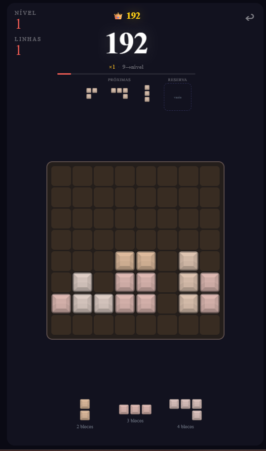

# OctoGrid

Jogo de puzzle para o browser: encaixa peças num tabuleiro 8×8, limpa linhas e colunas completas, encadeia combos e sobe de nível. Interface pensada para rato e toque, com som, efeitos visuais e recorde guardado no `localStorage`.

> Este repositório é um projeto independente; o nome **OctoGrid** não está associado a marcas de jogos comerciais.

## Pré-visualização



## Requisitos

- [Node.js](https://nodejs.org/) 20 ou superior

## Instalação

```bash
npm install
```

## Scripts

| Comando        | Descrição                          |
| -------------- | ---------------------------------- |
| `npm run dev`    | Servidor de desenvolvimento (Vite) |
| `npm run build`  | Build de produção em `dist/`       |
| `npm run preview` | Pré-visualização do build          |
| `npm run typecheck` | Verificação TypeScript sem emitir ficheiros |

## Stack

- **React** + **TypeScript**
- **Vite** (bundler e dev server)

## Configuração de jogo

Constantes de regras e balanceamento (incluindo multiplicador global de pontuação) estão em `src/game/constants.ts`.

## Áudio

Ficheiros em `public/Audio/`. Caminhos são referenciados em `src/game/audio.ts`.
